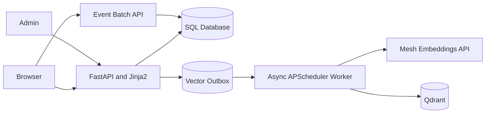

# SmartReco — Phase 1

SmartReco is a server-rendered course marketplace that lays the data foundation for a future behavioral recommendation product. Phase 1 includes email/password authentication, user/admin roles, a searchable catalog, admin CRUD, a transactional SQL vector outbox, Mesh embeddings, Qdrant synchronization, batched behavioral tracking, retries, and admin diagnostics.

Recommendation generation is deliberately not implemented: there are no recommendations, inferred interests, recommendation narratives, LangGraph workflows, chat-completion calls, personalized sections, or scheduled digests in this phase.

## Architecture



The HTTP layer is split from SQL models, services, and scheduler jobs. SQL is canonical. Course writes and their vector operations commit together in `vector_outbox`; the worker performs Mesh/Qdrant work later with bounded retries and course-version checks.

## Setup

Python 3.11 is the supported project runtime. SQLite is the default local database; PostgreSQL uses the async Psycopg driver.

```bash
python -m venv .venv
source .venv/bin/activate                 # Windows: .venv\Scripts\activate
pip install -r requirements.txt
cp .env.example .env                      # Windows: copy .env.example .env
alembic upgrade head
python scripts/create_admin.py
python scripts/seed_data.py
uvicorn app.main:app --reload
```

Set a strong `SECRET_KEY` for deployment. Mesh is optional for the catalog: without `MESH_API_KEY`, vector jobs become recoverable `FAILED` jobs with a clear configuration error. Qdrant can run locally at `QDRANT_PATH` or remotely with `QDRANT_URL` and `QDRANT_API_KEY`.

## Async database and migrations

`app/database.py` owns one async engine and an `async_sessionmaker` with `expire_on_commit=False`. Requests get short-lived sessions through `Depends(get_db)`. Alembic uses `async_engine_from_config`, `asyncio.run`, and `AsyncConnection.run_sync`; `alembic upgrade head` is the normal schema path. SQLite migrations use batch mode. PostgreSQL deployments should be used when multiple worker processes need concurrent vector workers.

The scheduler creates a fresh session for every claim and every processing operation. It never receives a request session or ORM object. SQLite claims are single-worker transactional updates; PostgreSQL claims use `FOR UPDATE SKIP LOCKED`.

## Dual-write and vector recovery

Course create/update/delete writes SQL and an immutable outbox snapshot in one transaction. The worker reloads the canonical course for upserts, skips stale versions as `SUPERSEDED`, uses the course UUID as the Qdrant point ID, and offloads synchronous Qdrant client calls with `asyncio.to_thread`. Retries use bounded delays of 30 seconds, 2 minutes, 10 minutes, 30 minutes, and then `FAILED`. Stale `PROCESSING` rows are recovered after `VECTOR_PROCESSING_TIMEOUT_SECONDS`.

```bash
python scripts/rebuild_vector_index.py --dry-run
python scripts/rebuild_vector_index.py --batch-size 20
python scripts/rebuild_vector_index.py --force
python scripts/rebuild_vector_index.py --course-id COURSE_UUID
```

The rebuild queues active courses and reuses the same idempotent worker path; it does not destroy the collection first.

## Authentication, CSRF, and flash messages

Passwords use Argon2 through `pwdlib`. Sessions are signed Starlette cookies with minimal IDs, role checks reload the user from SQL, login replaces authentication state, and logout is a CSRF-protected POST. HTML forms use a per-session token compared with `hmac.compare_digest`. JSON batches use `X-CSRF-Token`; beacon delivery cannot set a header, so `/api/events/beacon` validates `Origin` or same-origin `Referer`, content type, size, and the normal event schema. Flash messages are small values stored and popped from the signed session, not a nonexistent middleware.

## Behavioral tracking

`static/js/tracker.js` queues page views, course views, impressions, clicks, filter changes, searches, and dwell events in memory. Every event has a stable UUID `event_id` and `schema_version: 1`; retries reuse the same object. Impressions require 55% visibility for one second and use a 15-minute `sessionStorage` suppression window. Course-detail dwell includes the course UUID, while visibility-aware dwell is capped at 30 minutes and emitted only once. The tracker batches at ten events, flushes every five seconds, caps the queue, uses `fetch(..., keepalive)` and best-effort `sendBeacon` on exit, and never calls Mesh, Qdrant, or recommendation code. The event API validates each event independently, inserts valid events in bulk-like savepoints, and returns accepted, duplicate, and rejected counts. Legacy clients may omit `event_id` during the transition; the server generates one, while the frontend always sends one.

## Search autocomplete and history

The catalog and homepage search fields use `static/js/search-autocomplete.js`. Suggestions are deterministic SQL matches against active course titles, categories, tags, and instructors. The component waits 250 ms, cancels stale requests with `AbortController`, returns at most eight suggestions, and never calls Mesh or Qdrant.

```text
GET /api/search/suggestions?q=python&limit=8
GET /api/search/recent
```

Empty focused inputs show up to six recent searches. Authenticated history is read from the current user’s `SEARCH` activity events; anonymous history is capped and deduplicated in `localStorage` under `smartreco_recent_searches_v1`. Search submission remains the authoritative event boundary: typing and suggestion requests do not create events, while normal submission and selecting an option create one existing-contract `SEARCH` event. Recent history is private and responses use `Cache-Control: private, no-store`; suggestions use `no-store`.

The dropdown follows the ARIA combobox/listbox pattern with `aria-expanded`, `aria-controls`, `aria-activedescendant`, keyboard navigation, Escape/Tab closing, live result announcements, escaped text nodes, and mobile-sized options. No semantic search, personalization, or recommendation logic is involved.

### Version 1 event contract

Supported event types are `PAGE_VIEW`, `COURSE_IMPRESSION`, `COURSE_VIEW`, `COURSE_CLICK`, `SEARCH`, `FILTER_CHANGE`, and `DWELL`. All browser events require `event_id`, `schema_version`, `event_type`, `page_path`, and `occurred_at`; `course_id` is required for course view/click/impression and for dwell on `/courses/{slug}`; `SEARCH` requires a non-empty normalized `search_query`; `DWELL` requires bounded non-negative `duration_ms`. Metadata is optional and capped. Duplicate `event_id` delivery is successful and counted as a duplicate, not stored twice.

## Seed repair and account activity

The seed catalog is a list of explicit records with stable slugs, coherent categories, tags, descriptions, prices, and difficulty. The default command inserts missing records and leaves existing records alone. `--sync-existing` repairs only matching seed slugs, preserves IDs and event foreign keys, and creates an outbox UPSERT only when vector-relevant fields change. `--dry-run` rolls back all work. Reset is development-only and requires an explicit confirmation flag:

```bash
python scripts/seed_data.py --dry-run
python scripts/seed_data.py --sync-existing
python scripts/seed_data.py --reset --confirm-reset
```

The account page shows deterministic recently viewed courses, deduplicated searches, categories explored, and seven-day counts. It excludes raw impression rows and makes no AI calls.

## Admin pagination, archive, and diagnostics

`/admin/courses` accepts `page`, `page_size` (maximum 100), `q`, `active`, `vector_status`, and `sort` (`newest`, `oldest`, `title`, `recently_updated`). `/admin/events` accepts `page`, `page_size` (maximum 100), `event_type`, `user`, `user_id`, `course_id`, `date_from`, `date_to`, and `session_prefix`. Filters are applied in SQL and preserved in navigation. Archive hides a course and queues a Qdrant DELETE; restore is a CSRF-protected POST that reactivates the course and queues a new UPSERT. No hard deletion is implemented. Event metadata is escaped and expandable with `<details>`.

## Embedding lineage and reconciliation

Courses store the currently indexed embedding model, dimension, and schema version. Outbox UPSERT rows capture the target lineage immutably, and Qdrant payloads include `embedding_model`, `embedding_dimension`, `embedding_schema_version`, and `embedded_at`. Version 1 is the current course-text format (title, category, difficulty, instructor, duration, tags, short description, description). A model, dimension, or text-schema change makes older jobs/vectors stale instead of silently mixing configurations.

Reconciliation is read-only by default and classifies healthy, missing, stale-version, wrong-model, wrong-dimension, wrong-schema, metadata-mismatch, unexpected-active-point, and orphan vectors. Repairs queue normal SQL outbox work for courses; orphan cleanup is only operationally direct because no SQL course row exists to own such a point.

```bash
python scripts/reconcile_vectors.py --dry-run
python scripts/reconcile_vectors.py --repair
python scripts/reconcile_vectors.py --course-id COURSE_UUID --dry-run
```

## Testing

```bash
python -m compileall .
pytest
```

Tests use an isolated SQLite database and no real Mesh, Qdrant, network, or production credentials. The GitHub workflow is the official challenge workflow at `.github/workflows/smartreco-checks.yml`; it expects `MESH_API_KEY` and `SUBMISSION_TOKEN` in Repository → Settings → Secrets and variables → Actions.

## Deployment

Use PostgreSQL and remote Qdrant for multi-process deployments. Run migrations before starting the web service, set `SESSION_HTTPS_ONLY=true`, use a long random secret, keep `.env` out of version control, and run one dedicated scheduler process when multiple web workers are used. Do not use reload mode in production.

## Phase 2 handoff

Future work can consume `app/services/event_service.py` and the `ActivityEvent` repository for behavior aggregation, `catalog_service.py` for canonical course data, `embedding_service.py` for Mesh embeddings, and `VectorStore.search_courses()` for semantic retrieval. Recommendation tables, ranking/profile logic, a LangGraph workflow, scheduled digests, and LangSmith tracing should be added only in Phase 2.
