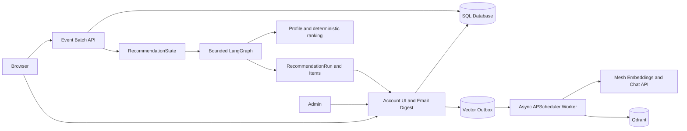

# SmartReco — Phase 2

SmartReco is a server-rendered course marketplace with a deterministic behavioral profile and catalog-grounded recommendation workflow. It preserves the Phase 1 foundation—authentication, catalog search, admin CRUD, transactional vector sync, Mesh embeddings, Qdrant, and behavioral tracking—and adds bounded LangGraph orchestration, grounded recommendation persistence, fallback retrieval/copy, opt-in email digests, and admin diagnostics.

Recommendations are available only to authenticated users. They are based on observed course activity, never on sensitive traits. Every AI call uses Mesh API; deterministic SQL fallback and copy keep the application usable when Mesh or Qdrant is unavailable.

## Architecture



The HTTP layer is split from SQL models, services, and scheduler jobs. SQL is canonical. Course writes and their vector operations commit together in `vector_outbox`; the worker performs Mesh/Qdrant work later with bounded retries and course-version checks.

## Setup

Python 3.11 is the supported project runtime. SQLite is the default local database; PostgreSQL uses the async Psycopg driver.

```bash
python -m venv .venv
source .venv/bin/activate                 # Windows: .venv\Scripts\activate
pip install -r requirements.txt
cp .env.example .env                      # Windows: copy .env.example .env
alembic upgrade head
python scripts/create_admin.py
python scripts/seed_data.py
uvicorn app.main:app --reload
```

Set a strong `SECRET_KEY` for deployment. Mesh is optional for the catalog: without `MESH_API_KEY`, vector jobs become recoverable `FAILED` jobs with a clear configuration error. Qdrant can run locally at `QDRANT_PATH` or remotely with `QDRANT_URL` and `QDRANT_API_KEY`.

## Async database and migrations

`app/database.py` owns one async engine and an `async_sessionmaker` with `expire_on_commit=False`. Requests get short-lived sessions through `Depends(get_db)`. Alembic uses `async_engine_from_config`, `asyncio.run`, and `AsyncConnection.run_sync`; `alembic upgrade head` is the normal schema path. SQLite migrations use batch mode. PostgreSQL deployments should be used when multiple worker processes need concurrent vector workers.

The scheduler creates a fresh session for every claim and every processing operation. It never receives a request session or ORM object. SQLite claims are single-worker transactional updates; PostgreSQL claims use `FOR UPDATE SKIP LOCKED`.

## Dual-write and vector recovery

Course create/update/delete writes SQL and an immutable outbox snapshot in one transaction. The worker reloads the canonical course for upserts, skips stale versions as `SUPERSEDED`, uses the course UUID as the Qdrant point ID, and offloads synchronous Qdrant client calls with `asyncio.to_thread`. Retries use bounded delays of 30 seconds, 2 minutes, 10 minutes, 30 minutes, and then `FAILED`. Stale `PROCESSING` rows are recovered after `VECTOR_PROCESSING_TIMEOUT_SECONDS`.

```bash
python scripts/rebuild_vector_index.py --dry-run
python scripts/rebuild_vector_index.py --batch-size 20
python scripts/rebuild_vector_index.py --force
python scripts/rebuild_vector_index.py --course-id COURSE_UUID
```

The rebuild queues active courses and reuses the same idempotent worker path; it does not destroy the collection first.

## Authentication, CSRF, and flash messages

Passwords use Argon2 through `pwdlib`. Sessions are signed Starlette cookies with minimal IDs, role checks reload the user from SQL, login replaces authentication state, and logout is a CSRF-protected POST. HTML forms use a per-session token compared with `hmac.compare_digest`. JSON batches use `X-CSRF-Token`; beacon delivery cannot set a header, so `/api/events/beacon` validates `Origin` or same-origin `Referer`, content type, size, and the normal event schema. Flash messages are small values stored and popped from the signed session, not a nonexistent middleware.

## Behavioral tracking

`static/js/tracker.js` queues page views, course views, impressions, clicks, filter changes, searches, and dwell events in memory. Every event has a stable UUID `event_id` and `schema_version: 1`; retries reuse the same object. Impressions require 55% visibility for one second and use a 15-minute `sessionStorage` suppression window. Course-detail dwell includes the course UUID, while visibility-aware dwell is capped at 30 minutes and emitted only once. The tracker batches at ten events, flushes every five seconds, caps the queue, uses `fetch(..., keepalive)` and best-effort `sendBeacon` on exit, and never calls Mesh, Qdrant, or recommendation code. The event API validates each event independently, inserts valid events in bulk-like savepoints, and returns accepted, duplicate, and rejected counts. Legacy clients may omit `event_id` during the transition; the server generates one, while the frontend always sends one.

## Search autocomplete and history

The catalog and homepage search fields use `static/js/search-autocomplete.js`. Suggestions are deterministic SQL matches against active course titles, categories, tags, and instructors. The component waits 250 ms, cancels stale requests with `AbortController`, returns at most eight suggestions, and never calls Mesh or Qdrant.

```text
GET /api/search/suggestions?q=python&limit=8
GET /api/search/recent
```

Empty focused inputs show up to six recent searches. Authenticated history is read from the current user’s `SEARCH` activity events; anonymous history is capped and deduplicated in `localStorage` under `smartreco_recent_searches_v1`. Search submission remains the authoritative event boundary: typing and suggestion requests do not create events, while normal submission and selecting an option create one existing-contract `SEARCH` event. Recent history is private and responses use `Cache-Control: private, no-store`; suggestions use `no-store`.

The dropdown follows the ARIA combobox/listbox pattern with `aria-expanded`, `aria-controls`, `aria-activedescendant`, keyboard navigation, Escape/Tab closing, live result announcements, escaped text nodes, and mobile-sized options. No semantic search, personalization, or recommendation logic is involved.

### Version 1 event contract

Supported event types include course activity plus `RECOMMENDATION_FEEDBACK_OPENED`, `RECOMMENDATION_REJECTED`, and `RECOMMENDATION_REPLACEMENT_SHOWN`. All browser events require `event_id`, `schema_version`, `event_type`, `page_path`, and `occurred_at`; metadata is optional and capped. Duplicate `event_id` delivery is successful and counted as a duplicate, not stored twice.

## Phase 2 recommendation workflow

Behavior flows through `ActivityEvent` → `RecommendationState` → the deterministic profile builder → eligibility policy → Mesh embedding/Qdrant or SQL fallback → deterministic ranker → bounded LangGraph → Mesh structured copy → grounding validator → `RecommendationRun` and `RecommendationItem`. The graph has explicit profile, retrieval, ranking, quality, one-step refinement, generation, validation, fallback, and persistence nodes. It never receives raw event history or credentials and cannot write arbitrary SQL or Qdrant data.

Profiles use a 30-day window with a 14-day half-life decay: `0.5 ** (event_age_days / half_life_days)`. Searches, clicks, views, qualified dwell, filters, impressions, and recommendation interactions have different bounded signal strengths; impressions remain weak. Profile hashes prevent unnecessary rebuilds. Recommendation runs observe a 30-minute cooldown, six-hour freshness TTL, bounded leases, and retry backoff.

Semantic retrieval uses the existing Qdrant collection and rejects inactive or incompatible-lineage points before reloading SQL course truth. SQL retrieval is used for cold start, missing Mesh configuration, Qdrant failures, and low-quality retrieval. Ranking combines semantic, category, tag, search, dwell, novelty, featured, and recent-view components with deterministic diversity limits. Refinement is attempted at most once.

Mesh chat output is JSON-only and may select only supplied course IDs. It is validated for active-course membership, duplicate IDs, bounded text, evidence, and prohibited guarantees. Invalid output gets one repair attempt, then deterministic fallback copy. No recommendation is generated during event ingestion.

## Recommendation API and UI

Authenticated endpoints:

```text
GET  /api/recommendations/current
POST /api/recommendations/refresh
POST /api/recommendations/items/{item_id}/dismiss
POST /api/recommendations/items/{item_id}/feedback
GET  /recommendations
POST /account/recommendation-preferences
```

The account page and `/recommendations` display grounded course cards, fallback/cold-start messaging, qualified recommendation impressions, click attribution, and CSRF-protected feedback. “Not for me” records one of the stable reason codes in migration `0007_recommendation_feedback`, hides the rejected item, preserves the other visible cards, and selects one deterministic replacement without a long-running request. The old dismissal endpoint remains compatible as `NOT_RELEVANT_NOW`. Recommendation data is scoped to the current user. Admins can inspect paginated runs and feedback markers at `/admin/recommendations`.

## Contextual related courses

Course-detail pages also show up to two `Related courses` cards below the current course tags. This is a separate contextual path: it uses the current course's stored Qdrant vector, validates vector lineage, reloads active course truth from SQL, and applies deterministic category, tag-overlap, difficulty, and semantic scoring. It never reads user activity, profiles, recommendation runs, or email preferences, and it never calls Mesh chat or LangGraph. If Qdrant is unavailable, stale, missing, or too slow, bounded SQL fallback candidates keep the course page available. The result cache is keyed by course/version and embedding lineage.

Related cards use the existing batched tracker with `COURSE_IMPRESSION` and `COURSE_CLICK` events carrying `metadata.source=related_course`, `source_course_id`, `target_course_id`, and `rank`. They do not use recommendation run/item IDs, so contextual similarity remains measurable separately from personalized recommendations.

## Scheduled delivery and observability

Email delivery is opt-in. The console provider is the safe default; SMTP uses `EMAIL_PROVIDER=smtp` plus the documented SMTP settings. APScheduler queues one digest per user-local date, sends bounded batches, records attempts, and retries transient failures. LangSmith tracing is optional and disabled unless `LANGSMITH_TRACING=true` and a key are configured; recommendation generation does not fail when tracing is unavailable.

Phase 2 configuration includes `MESH_BASE_URL`, `MESH_CHAT_MODEL`, `MESH_REQUEST_TIMEOUT_SECONDS`, `MESH_MAX_RETRIES`, `MESH_TOTAL_BUDGET_SECONDS` (default 70 seconds), `RECOMMENDATION_*`, `RELATED_COURSES_*`, `EMAIL_*`, `SMTP_*`, `APP_BASE_URL`, and optional `LANGSMITH_*` variables. The total Mesh budget covers the primary call and the single structured-output repair attempt. Provider failures fall back to deterministic copy with sanitized run errors; cancellation and unexpected failures finalize the owned run through a fresh session. `.env.example` contains placeholders only.

## Phase 2 commands

```bash
python scripts/generate_recommendation.py --user-id UUID --no-llm --show-profile --show-candidates
python scripts/evaluate_recommendations.py --dry-run
python scripts/reconcile_vectors.py --dry-run
```

The generation command supports `--dry-run`, `--no-llm`, `--show-profile`, and `--show-candidates`. Its JSON reports `llm_enabled`, actual `llm_called`, and the backward-compatible `llm` field. The evaluation harness is read-only and uses deterministic personas; it does not call Mesh.

## Seed repair and account activity

The seed catalog is a list of explicit records with stable slugs, coherent categories, tags, descriptions, prices, and difficulty. The default command inserts missing records and leaves existing records alone. `--sync-existing` repairs only matching seed slugs, preserves IDs and event foreign keys, and creates an outbox UPSERT only when vector-relevant fields change. `--dry-run` rolls back all work. Reset is development-only and requires an explicit confirmation flag:

```bash
python scripts/seed_data.py --dry-run
python scripts/seed_data.py --sync-existing
python scripts/seed_data.py --reset --confirm-reset
```

The account page shows deterministic recently viewed courses, deduplicated searches, categories explored, and seven-day counts. It excludes raw impression rows and makes no AI calls.

## Admin pagination, archive, and diagnostics

`/admin/courses` accepts `page`, `page_size` (maximum 100), `q`, `active`, `vector_status`, and `sort` (`newest`, `oldest`, `title`, `recently_updated`). `/admin/events` accepts `page`, `page_size` (maximum 100), `event_type`, `user`, `user_id`, `course_id`, `date_from`, `date_to`, and `session_prefix`. Filters are applied in SQL and preserved in navigation. Archive hides a course and queues a Qdrant DELETE; restore is a CSRF-protected POST that reactivates the course and queues a new UPSERT. No hard deletion is implemented. Event metadata is escaped and expandable with `<details>`.

## Embedding lineage and reconciliation

Courses store the currently indexed embedding model, dimension, and schema version. Outbox UPSERT rows capture the target lineage immutably, and Qdrant payloads include `embedding_model`, `embedding_dimension`, `embedding_schema_version`, and `embedded_at`. Version 1 is the current course-text format (title, category, difficulty, instructor, duration, tags, short description, description). A model, dimension, or text-schema change makes older jobs/vectors stale instead of silently mixing configurations.

Reconciliation is read-only by default and classifies healthy, missing, stale-version, wrong-model, wrong-dimension, wrong-schema, metadata-mismatch, unexpected-active-point, and orphan vectors. Repairs queue normal SQL outbox work for courses; orphan cleanup is only operationally direct because no SQL course row exists to own such a point.

```bash
python scripts/reconcile_vectors.py --dry-run
python scripts/reconcile_vectors.py --repair
python scripts/reconcile_vectors.py --course-id COURSE_UUID --dry-run
```

## Testing

```bash
python -m compileall .
pytest
```

Tests use an isolated SQLite database and no real Mesh, Qdrant, network, or production credentials. The GitHub workflow is the official challenge workflow at `.github/workflows/smartreco-checks.yml`; it expects `MESH_API_KEY` and `SUBMISSION_TOKEN` in Repository → Settings → Secrets and variables → Actions.

## Deployment

Use PostgreSQL and remote Qdrant for multi-process deployments. Run migrations before starting the web service, set `SESSION_HTTPS_ONLY=true`, use a long random secret, keep `.env` out of version control, and run one dedicated scheduler process when multiple web workers are used. Do not use reload mode in production.

## Future handoff

Future work can extend `app/services/interest_profile_service.py`, `recommendation_retrieval_service.py`, `recommendation_ranking_service.py`, and the bounded graph without rewriting Phase 1. Additional evaluation, enrollment/completion signals, and delivery channels should reuse the validated recommendation persistence and policy boundaries.

## Course commerce

Commerce is intentionally demo-only. `shopping_carts` hold intent, `orders` hold checkout snapshots, `course_entitlements` grant access, and `enrollments` begin learning. Purchase grants course access; starting the course creates enrollment. Existing enrollments are backfilled as `LEGACY_ENROLLMENT` by migration `0006_commerce`.

Course actions are context-sensitive: free or purchased courses show `Start course`, in-progress courses show `Continue course`, completed courses show `Review course`, paid courses show `Buy course` plus `Add to cart`, and cart items show `Buy course` plus `View cart`. Anonymous users see the corresponding sign-in action.

`PAYMENTS_ENABLED=true`, `PAYMENTS_MODE=demo`, `CART_MAX_ITEMS=25`, and `DEFAULT_CURRENCY=USD` are safe defaults. Demo checkout does not collect payment credentials or process real money. Replace `DemoPaymentGateway` in `app/services/payments/` for a real provider without changing cart, order, entitlement, or enrollment services.

## Explainable learning path

`/recommendations` separates learner context from next-step suggestions. Active enrollments appear under Continue learning, purchased-but-unstarted entitlements appear under Ready to start, and completed or enrolled courses influence progression while remaining excluded from candidates. Recent views, clicks, dwell, qualified impressions, searches, and dismissals remain bounded profile signals; a view is never treated as completion.

Each suggestion has a `reason`, `how_it_helps`, `skill_connection`, and bounded evidence identifiers stored in the existing recommendation evidence JSON. The server resolves safe labels and filters stale, owned, enrolled, completed, inactive, and dismissed courses at render time. Mesh receives only safe course summaries, candidate IDs, and allowed evidence IDs; deterministic copy is used when its output is unavailable or fails grounding validation.

Recommendation feedback is bounded and recency-decayed: “too advanced” and “too basic” adjust difficulty, “more practical” favors project-oriented metadata, “too expensive” favors free or lower-priced courses, and topic rejection penalizes matching categories/tags without erasing unrelated interests. Free-form comments are optional, capped, and never sent to Mesh or browser profile payloads.
